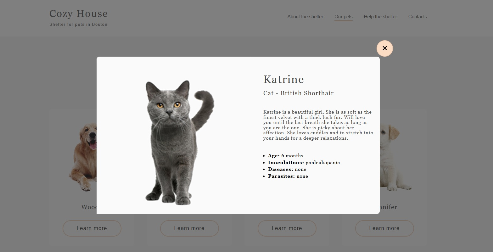

# Shelter

Shelter – это учебный проект Stage#0 курса "JavaScript / Front-end Course" школы Rolling Scopes School (RS Schoo), в ходе выполнения которого сверстан сайт, состоящий из двух страниц.

[Ссылка на демонтацию проекта](https://mariasuz.github.io/Shelter/shelter/index.html) 

## Этапы работы над проектом: 
### Фиксированная вёрстка.
Необходимо было верстать страницы в 1280px, согласно макету в [figma](https://www.figma.com/design/oqxe9aWFAPBY5nE0Iilnry/shelter-(Copy)?node-id=94-43&p=f&t=7YMyEIMMHidYFXAu-0). Отклонение от макета не более 10px, проверялось с помощью PerfectPixel.
### Адаптивная вёрстка.
Ранее сверстанные страницы адаптируются для планшетов и мобильных устройств. На разрешениях 1280px, 768рх и 320px ставится задача совпадения вёрстки с соответствующим [макетом](https://www.figma.com/design/oqxe9aWFAPBY5nE0Iilnry/shelter-(Copy)?node-id=94-43&p=f&t=7YMyEIMMHidYFXAu-0).
На остальных разрешениях до 320рх включительно обеспечивается отсутствие горизонтальной полосы прокрутки при выполнении адаптивности и резиновости верстки, сохранении всего контента страницы, отсутствие изменения пропорций изображений, отсутствие белых полей справа от блоков.
### Добавление функционала при помощи JavaScript.
В этой части задания необходимо было добавить в свёрстанные на предыдущих этапах веб-страницы следующий функционал, используя чистый JavaScript:

- открытие и закрытие бургер-меню на страницах при ширине <768px
- бесконечный слайдер-карусель на странице Main
- пагинацию на странице Pets
- попап на обеих страницах
